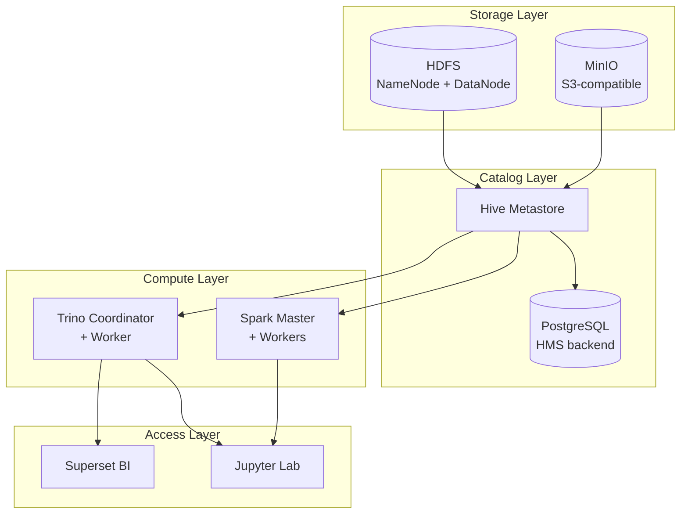

# CDP-Lite: Containerized Mini Lakehouse Lab

> A production-style data lakehouse you can run on your laptop. Built with Docker, Kubernetes, and inspired by Cloudera CDP architecture.

[](https://www.docker.com/)
[](https://kubernetes.io/)
[](https://www.redhat.com/)

---

## Why this exists

Most "Hadoop tutorials" stop at HDFS + Hive. Real lakehouses include object storage, a SQL engine, a metastore, a query layer, and a BI front-end — and run on container orchestration. This repo gives you all of that in a single `docker compose up`, plus a Kubernetes deployment path and an Ansible playbook for RHEL/Rocky bare-metal.

It is intentionally modeled after the layered architecture of **Cloudera CDP Private Cloud Base + Data Services on ECS**, scaled down to ~6 GB RAM so you can demo it on a laptop.

## Architecture



| Layer | Component | CDP Equivalent |
|---|---|---|
| Storage | MinIO | Ozone / S3 |
| Storage | HDFS 3.3 | HDFS |
| Catalog | Hive Metastore 3.1 | Hive Metastore |
| Catalog | PostgreSQL 15 | PostgreSQL backend |
| Compute | Apache Spark 3.5 | Spark on YARN |
| Compute | Trino 435 | Impala / Hue |
| Access | Apache Superset | Cloudera Data Visualization |

## Quickstart

```bash
# 1. Clone
git clone https://github.com/lacerta15/cdp-lite-lakehouse.git
cd cdp-lite-lakehouse

# 2. Set env vars
cp .env.example .env

# 3. Start the stack (takes ~3 min on first run)
docker compose up -d

# 4. Initialize MinIO bucket + sample data
./scripts/init-minio.sh
./scripts/load-sample-data.sh

# 5. Open the UIs
echo "MinIO Console : http://localhost:9001  (minio/minio123)"
echo "Spark Master  : http://localhost:8080"
echo "Trino UI      : http://localhost:8081"
echo "Superset      : http://localhost:8088 (admin/admin)"
echo "HDFS NameNode : http://localhost:9870"
```

## Demo workflow (5 minutes)

1. **Ingest** — drop a CSV in `./data/`, run `./scripts/load-sample-data.sh` → lands in MinIO bucket `lakehouse/raw/`.
2. **Catalog** — run `./scripts/register-tables.sh` → Hive Metastore now knows about `nyc_trips_raw`.
3. **Transform** — open Jupyter, run `notebooks/01_etl.ipynb` to produce a curated Iceberg table in `lakehouse/curated/`.
4. **Query** — open Trino UI and run `SELECT vendor_id, AVG(fare_amount) FROM hive.curated.nyc_trips GROUP BY 1`.
5. **Visualize** — open Superset, the `nyc_trips` dataset is pre-registered. Build a chart in 30 seconds.

Full walkthrough: [`docs/DEMO.md`](docs/DEMO.md).

## Deployment paths

| Path | Use case | File |
|---|---|---|
| Docker Compose | Laptop demo, dev | [`docker-compose.yml`](docker-compose.yml) |
| Kubernetes (kind/k3s/OpenShift) | Realistic K8s practice | [`kubernetes/`](kubernetes/) |
| Ansible on RHEL/Rocky | Bare-metal install | [`ansible/playbook.yml`](ansible/playbook.yml) |

## Custom Docker images

Three images are built and pushed to Docker Hub by the included GitHub Actions workflow:

```
docker pull <your-docker-name>/cdp-lite-hive-metastore:3.1.3
docker pull <your-docker-name>/cdp-lite-spark:3.5.0
docker pull <your-docker-name>/cdp-lite-superset:3.0.1
```

Each image is hardened: non-root user, slim base, healthcheck, and OCI labels.

## Repo layout

```
cdp-lite-lakehouse/
├── docker-compose.yml
├── docker/                # Custom Dockerfiles
├── config/                # Hadoop, Hive, Trino configs
├── kubernetes/            # K8s manifests (apply with `kubectl apply -k`)
├── ansible/               # Provisioning for RHEL/Rocky 9
├── scripts/               # Helper scripts (init-minio, load data, demo queries)
├── data/                  # Sample dataset (NYC taxi sample)
└── docs/                  # Architecture deep-dive + demo walkthrough
```

## Roadmap

- [x] Docker Compose stack
- [x] Kubernetes manifests
- [x] Ansible RHEL playbook
- [x] Sample ETL workflow
- [ ] Apache Ranger integration (RBAC)
- [ ] Apache Atlas integration (lineage)
- [ ] Helm chart packaging
- [ ] OpenShift Operator

## About Me
Built by a Cloudera CDP and Red Hat DevOps practitioner. 
Find more at [LinkedIn →](https://www.linkedin.com/in/merdias-fajar-aab4301b1/).

